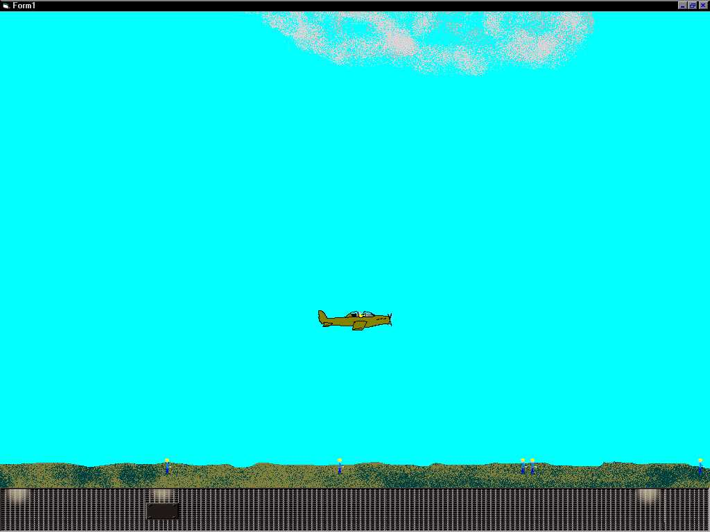



## \_Wings of Fury

### Description

This is a remake of the Apple IIe classic "Wings of Fury" You are a pilot of a P-51 Mustang and are attempting to rid islands of their inhabitans by strafing them.

*WARNING* This is a work-in-progress. As to this date, the program runs but it is FAR from finished. I am submitting so that others may leave suggestions or use it to make their own game. It is heavily commented and should be easy to follow. I commented about BitBlt extremely well and this would be a great example for anyone learning it.

ENJOY!!!

Update 1: Now includes Pixel Collision for landing and the plane has guns

Update 2: Guns now kill people(little graves pop up, it's morbid but funny) and bullets kick up sand, dirt and water

Update 3: Bombs! They don't kill yet but they will
 
### More Info
 
Arrow Keys

I used to play this game when I was like 6 or 7 on my dads Apple IIe. To this day, I still consider it one of the most fun games I've ever played, that is why I am trying to remake it

A fun game

This program uses memory pointers, if the program terminates irregularly, it can cause these pointers to be lost and therefore the memory unusable. To free this memory, you must restart your computer. (This sounds worse than it is, it's not a big deal)

             |
---                |---
**Submitted On**   |2001-07-31 14:44:42
**By**             |[Chad Bjorklun](https://github.com/Planet-Source-Code/PSCIndex/blob/master/ByAuthor/chad-bjorklun.md)
**Level**          |Intermediate
**User Rating**    |3.8 (15 globes from 4 users)
**Compatibility**  |VB 5\.0, VB 6\.0
**Category**       |[Games](https://github.com/Planet-Source-Code/PSCIndex/blob/master/ByCategory/games__1-38.md)
**World**          |[Visual Basic](https://github.com/Planet-Source-Code/PSCIndex/blob/master/ByWorld/visual-basic.md)
**Archive File**   |[Wings of F238227312001\.zip](https://github.com/Planet-Source-Code/chad-bjorklun-wings-of-fury__1-25664/archive/master.zip)

### API Declarations

A bunch but there all in the code

